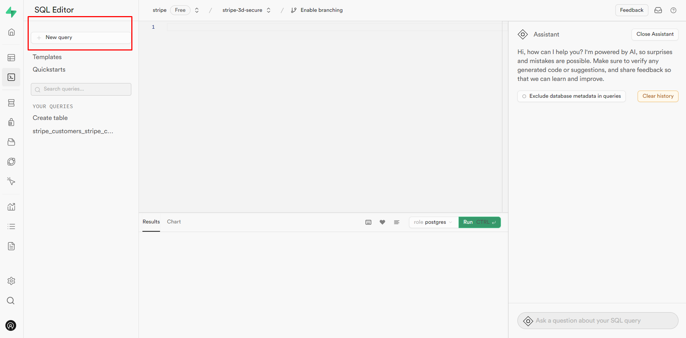

## Setup Instructions

1. **Create Tables in Supabase SQL Editor**


  - Copy and paste the following SQL commands into the Supabase SQL Editor to create the necessary tables:
```sql
create table public.stripe_customers (
  id uuid not null default uuid_generate_v4 (),
  user_id uuid not null,
  stripe_customer_id text not null,
  total_downloads integer null default 0,
  plan_active boolean not null default false,
  plan_expires bigint null,
  subscription_id text null,
  constraint stripe_customers_pkey primary key (id),
  constraint stripe_customers_stripe_customer_id_key unique (stripe_customer_id),
  constraint stripe_customers_user_id_fkey foreign key (user_id) references auth.users (id)
) tablespace pg_default;

create table public.downloads (
  id uuid not null default uuid_generate_v4 (),
  user_id uuid not null,
  ts timestamp without time zone null default now(),
  image text null,
  constraint downloads_pkey primary key (id),
  constraint downloads_user_id_fkey foreign key (user_id) references auth.users (id)
) tablespace pg_default;
```

2. **Configure Stripe Product**

- Navigate to the Stripe Dashboard.
- Click on "Product catalog".
- Click "Add product" and create a recurring product.
- Select "More Pricing Option" and then "Usage based pricing".


3. **Install npm & Run Development Server**

- npm install 
- npm run dev
